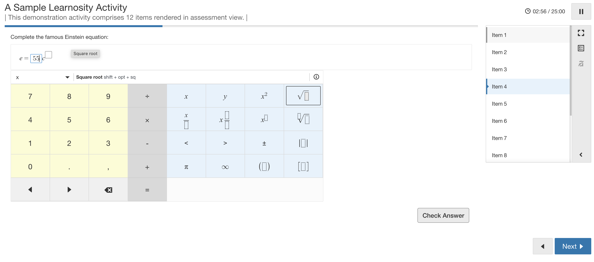

# React + Learnosity + Sentry

## How to run the project

### 1 - Run Learnosity SDK

```js
cd server
npm install
node index.js
```

The server will be running on http://localhost:3000

### 2 - Run React + Sentry

1 - Create a javascript-react project in https://sentry.io/for/react/ and obtain the DSN

2 - go to assessment-player/sentryInit.ts and add the Sentry DSN of the project you created

3 -

```js
cd assessment-player
npm install
npm run dev
```

The react app will be running on http://localhost:5173/

### 3 - Reproduce the issue

1 - With both projects running, go to http://localhost:5173/ , it will load an assessment player form Learnosity.

2 - Make sure that on assessment-player/sentryInit.ts you have: enabled: true,

3 - Start the assessment, go to Item 4, which has a text input and type a number with your computer keyboard. You will see that the number is duplicated.



4 - Go to assessment-player/sentryInit.ts , change the value to false, reload the react project and go back to the Item 4 and type some number on the text input. You should see that the 'duplicating' issue is no longer there.
